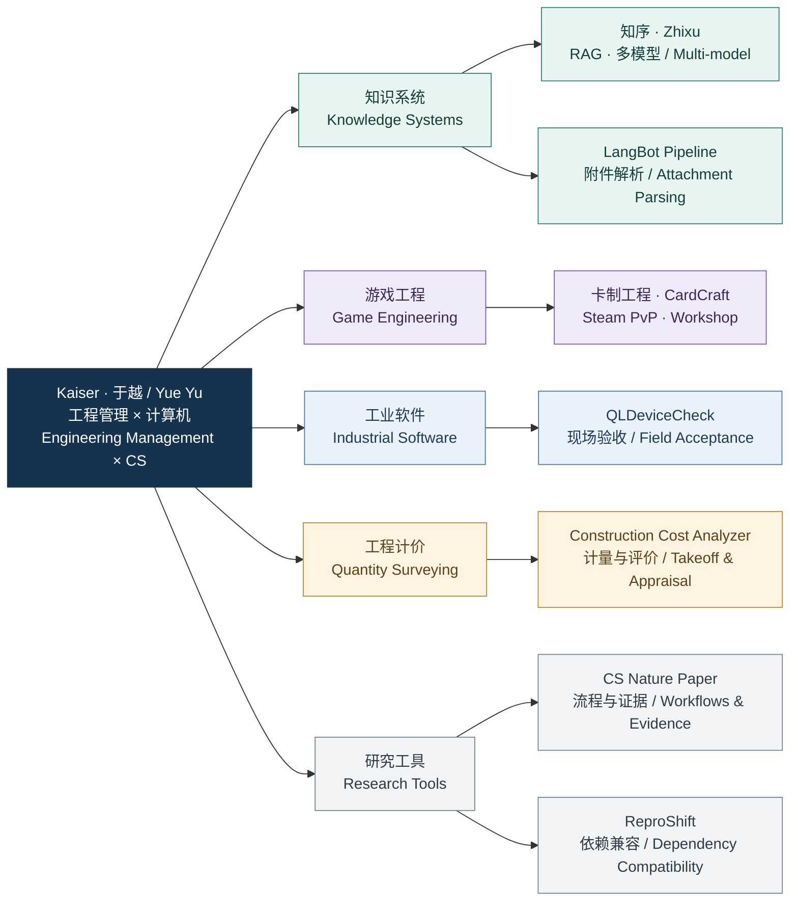

# Kaiser · 于越 / Yue Yu

**Engineering Management × Computer Science · AI Tools · Industrial Software · Game Engineering**

东北林业大学工程管理专业，辅修计算机科学。我做文档与知识系统、工业验收工具、工程计量计价和游戏，关注领域规则、可用的界面，以及能追溯和复核的结果。

I study Engineering Management at Northeast Forestry University with a minor in Computer Science. I build knowledge systems, industrial acceptance tools, quantity surveying software and games, connecting domain rules with usable interfaces and traceable results.

## 工程方向 / Engineering Map

## 重点项目 / Featured Projects

### [知序 / Zhixu · Enterprise Knowledge](https://github.com/KaiserIIII/zhixu)

免费、开源、自托管的团队知识工作台。支持多租户与角色权限、多知识库、模块化文件解析、混合检索和重排；通过可视化拖拽工作流连接多个模型，保留工作流版本、运行轨迹和引用证据。包含会话反馈、知识缺口分析与检索评测，提供中英文管理界面，默认不采集遥测。

A free, open-source, self-hosted knowledge workspace with tenant isolation, role-based access, multiple knowledge bases, modular file parsing, hybrid retrieval and reranking. Drag-and-drop workflows connect multiple models with version history, execution traces and source citations. Includes conversation feedback, knowledge-gap analysis, retrieval evaluation and a Chinese–English management interface. No telemetry is collected by default.

**FastAPI · SQLAlchemy · ChromaDB · BM25 · JavaScript · Apache-2.0**

### [卡制工程 / CardCraft Engineering](https://github.com/KaiserIIII/cardcraft-engineering-portfolio)

一款以自定义卡牌与构筑为核心的 Godot 策略卡牌游戏，支持本地 AI 对战、Steam 在线 PvP 和 Workshop 卡牌与牌组分享。工程内容覆盖好友房间与匹配、P2P 状态与消息校验、用户内容隔离、存档迁移、国际化和 Windows 发布验证。公开仓库提供架构说明、工程案例与独立示例。

A Godot strategy card game built around designing cards and constructing decks, with local AI battles, online Steam PvP and Workshop sharing of cards and decks. Engineering work covers friend lobbies and matchmaking, P2P state and message validation, content isolation, save migration, localization and Windows release verification. The public repository contains architecture notes, case studies and standalone examples.

[Steam 商店与 Demo / Steam Store & Demo](https://store.steampowered.com/app/4338300/_/) · [工程作品集 / Engineering Portfolio](https://github.com/KaiserIIII/cardcraft-engineering-portfolio)

**Godot · GDScript · Steamworks · P2P Networking · Workshop UGC**

### [QLDeviceCheck · 现场验收工作台 / Field Acceptance Workbench](https://github.com/KaiserIIII/QLDeviceCheck_Generic_WebUI_Linux)

从设备清单创建验收任务，保存配置快照、协议证据和检测报告。支持串口、网络与 PCI 检查、失败项复测和结果对比；模拟演示与真实检测记录分开保存。提供中英文界面，以及包含离线运行依赖的 Windows / Linux 发布包。

Turn equipment lists into traceable acceptance tasks with configuration snapshots, protocol evidence and inspection reports. Supports serial, network and PCI checks, failed-only retests and result comparison. Simulated demonstrations keep separate records from live inspections. Includes a Chinese–English interface and Windows / Linux packages with offline runtime dependencies.

**Python · SQLite · Modbus RTU/TCP · Linux · MIT**

### [Construction Cost Analyzer · 工程计量计价与开发评价](https://github.com/KaiserIIII/construction-cost-analyzer)

本地浏览器工作台与 CLI 共用计算引擎，覆盖工程量计算、工料机组价、清单计价、历史价格指数调整和住宅开发方案比较。包含月度融资、现金流与敏感性分析；导出 Excel、HTML、CSV、JSON 和交付包，并保留输入、价格来源与计算依据。支持中文、英文和双语报告。

A local browser workspace and CLI sharing one engine for quantity takeoff, resource-based unit rates, BOQs, historical price-index adjustments and residential development options. Includes monthly finance, cashflows and sensitivity analysis. Exports Excel, HTML, CSV, JSON and delivery packages with inputs, price sources and calculation bases, using Chinese, English or bilingual report labels.

**Python · Decimal · JavaScript · HTML/CSS · MIT**

## AI 工具与研究 / AI Tools & Research

| 项目 / Project | 内容 / Work | 技术 / Stack |
| --- | --- | --- |
| [LangBot Unified Attachment Pipeline](https://github.com/KaiserIIII/langbot-unified-attachment-pipeline) | 可安装的 Parser 插件：多格式附件解析、视觉模型主备回退、文件哈希绑定上下文与版本化长期记忆。 / Installable Parser plugin with multi-format parsing, vision fallback, hash-bound context and versioned memory. | Python, LangBot, SQLite |
| [CS Nature Paper V4.1.0](https://github.com/KaiserIIII/cs-nature-paper-skill) | 研究流程编排、研究图谱与论文证据追溯；[系统结构图 / Architecture](https://github.com/KaiserIIII/cs-nature-paper-skill/blob/main/README_zh.md#系统结构一览)。 / Research orchestration, evidence provenance and a linked system architecture overview. | Python, Agent Skills, JSON Schema |
| [ReproShift](https://github.com/KaiserIIII/reproshift-artifact) | Python 历史依赖兼容性与约束修复研究产物，区分包可用性、wheel 可用性和二进制依赖解析。 / Research artifact separating package availability, wheel availability and binary resolution when evaluating historical compatibility and constraint repair. | Python, pip, Statistical Analysis |

## 更多项目 / More Work

- [Return-to-Source Hysteresis](https://github.com/KaiserIIII/return-to-source-hysteresis)：测试时自适应的回源行为、配置效应与方法稳定性研究，附实验代码和研究草稿。 / Research code and a draft on return-to-source behavior, configuration effects and method stability in test-time adaptation.
- [Campus UAV Inspection Manager](https://github.com/KaiserIIII/-UAV-inspection-task-management-system-in-college-parks)：校园无人机设备调度、任务冲突检查、异常与维修跟踪的数据库应用原型。 / A database application prototype for UAV scheduling, assignment conflicts, abnormalities and repair tracking.
- [General Simulator · 将军模拟器](https://github.com/KaiserIIII/jiangjun)：基于事件决策与共享状态的 Godot 策略游戏原型。 / A Godot strategy prototype with event-driven decisions and shared game state.
- [Claude ↔ Codex Bridge](https://github.com/KaiserIIII/claude-codex-bridge)：通过本地 JSON 消息交换任务、回复和文件引用，保留会话与回复关系。 / Local JSON exchange of tasks, replies and file references with thread and reply tracking.
- [KAISER Portfolio](https://github.com/KaiserIIII/kaiser-site)：Astro 与 TypeScript 个人作品网站，使用结构化项目数据、可复用组件和静态构建。 / An Astro and TypeScript portfolio with structured project data, reusable components and static builds.
- [Aseprite Builder](https://github.com/KaiserIIII/aseprite-builder)：上游构建工作流的 fork，当前启用 Windows 构建。 / An upstream build-workflow fork with Windows builds enabled.

[GitHub](https://github.com/KaiserIIII) · [Email / 邮箱](mailto:kaiser@nefu.edu.cn)
